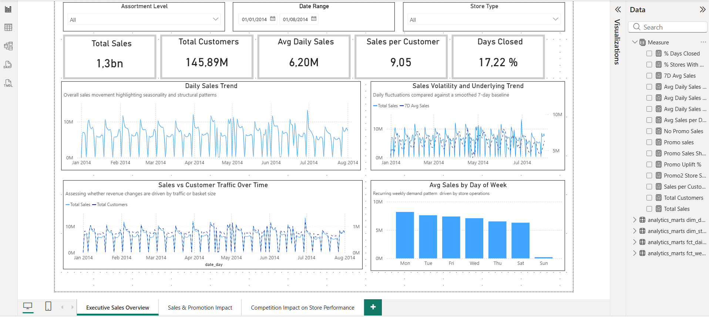
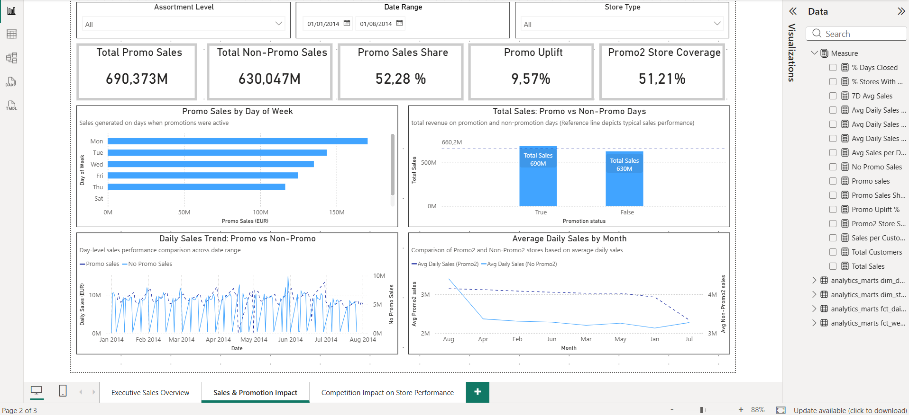
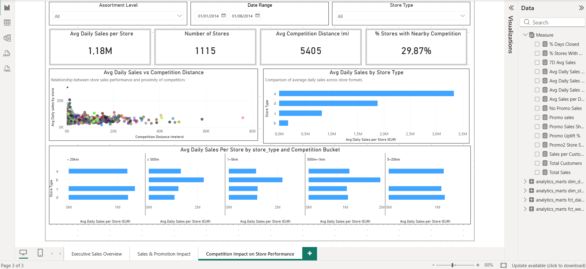

# Rossmann Analytics Engineering Project 🚀

**End‑to‑end analytics engineering project** built on the [Rossmann Store Sales dataset](https://www.kaggle.com/c/rossmann-store-sales).  
Demonstrates a production‑style analytics workflow: 

**raw ingestion → deterministic cleaning (Python) → warehouse modeling with (dbt) → Power BI dashboard.

* * *

## Key environment 🔧

- **Python:** 3.11.9
- **dbt:** 1.10.17
- **PostgreSQL:** 16.11
- **Power BI:** latest (Desktop)

* * *

## How to run Project⚡

1.  Create & activate venv (Windows):  
    `python -m venv .venv && .venv\Scripts\activate`
2.  Install Python deps:  
    `pip install -r requirements.txt`
3.  Run ETL notebooks in order:
    - [01_explore_raw.ipynb](notebooks/01_explore_raw.ipynb)
    - [02_clean_transform.ipynb](notebooks\02_clean_transform.ipynb)
    - [03_load_postgre.ipynb](notebooks\03_load_postgre.ipynb)
4.  Initialize dbt and build models:
    - `cd rossmann_dbt`
    - `dbt deps` (install dbt packages)
    - `dbt debug`
    - `dbt build` (or `dbt run && dbt test`)
    - `dbt docs generate && dbt docs serve` (optional)
5.  Open Power BI and connect to PostgreSQL (host/port/dbname) for the dashboard.

* * *

## Repository structure 📁

```text
Rossmann_dbt  
├── data_raw/ # Raw input data (gitignored)  
├── data_clean/ # Cleaned outputs (gitignored)  
├── notebooks/ # Python ETL notebooks  
│ ├── 01_explore_raw.ipynb  
│ ├── 02_clean_transform.ipynb  
│ └── 03_load_postgre.ipynb  
├── rossmann_dbt/ # dbt project (models[staging,intermediate,marts], tests, packages.yml)  
│   ├── models/
│   │   ├── staging/
│   │   ├── intermediate/
│   │   └── marts/
│   ├── tests/
│   ├── macros
│   ├── seeds
│   ├── snapshots
│   ├── dbt_project.yml
│   ├── packages.yml
│   └── profiles.example.yml (template file)
├── dashboard/ # Power BI files, Exports
├── images 
├── ETL_RUN_LOG.md # Executed ETL run documentation  
├── requirements.txt # Pinned Python deps
├── README.md
└── .gitignore
```

* * *

## Data cleaning (Python) ✨

Performed in the [02_clean_transform](notebooks\02_clean_transform.ipynb) 

Key steps: 
- Parsed dates
- Normalized holidays
- Validated & dropped inconsistent fields 
- Coerce stable dtypes
- Sanity checks (duplicates / open vs sales)
- Saved cleaned outputs to data_clean 🔧

Cleaned CSVs are produced locally and intentionally excluded from Git.

* * *

## dbt modeling & testing 🧩

- Sources: `raw.sales_raw`, `raw.stores_raw` (Defined in rossmann_dbt\models\staging\sources.yml )
- Layers: staging → intermediate → marts
- Tests: schema tests, business tests, `dbt_utils`\-based checks
- Note: dbt package `dbt_utils==1.3.3` is declared in `[package-lock.yml](rossmann_dbt\package-lock.yml)` and installed via `dbt deps`.

### dbt lineage graph

Generated via `dbt docs generate`:

```text
images/dbt_lineage_graph.png
```


This graph shows the full transformation flow from raw sources → staging → intermediate → marts → exposure.
* * *

## Dashboard (Power BI) 📊

The Power BI dashboard is built **directly on top of dbt marts** and is structured as a **three-page analytical narrative**, progressing from executive-level monitoring to deeper business drivers.

The dashboard is fully interactive with slicers for **date range, store type, and assortment level**.

---

### 1 - Executive Sales Overview

High-level performance view designed for leadership and rapid monitoring.

**Key KPIs**
- Total Sales  
- Total Customers  
- Average Daily Sales  
- Sales per Customer  
- % Days Closed  

**Key visuals & insights**

- Daily sales volatility vs 7-day moving average (trend smoothing)
- Sales vs customer traffic to distinguish volume vs basket effects
- Weekly seasonality pattern by day of week
- Overall sales trend highlighting structural patterns over time



### 2 - Sales & Promotion Impact

Focused analysis of promotional effectiveness and uplift.

**Key KPIs**

- Promo uplift (%)
- Total promo vs non-promo sales
- Promo sales share
- Promo2 store coverage

**Key visuals & insights**
- Daily sales comparison: promo vs non-promo days
- Revenue contribution of promotions vs baseline sales
- Promo sales performance by day of week
- Average daily sales comparison: Promo2 vs non-Promo2 stores



### 3 - Competition Impact on Store Performance

Store-level performance analysis with a focus on competitive pressure.

**Key KPIs**

Average daily sales per store
Number of stores
Average competition distance
% stores with nearby competition

**Key visuals & insights**

- Relationship between competition distance and store sales
- Average daily sales by store type
- Sales performance segmented by competition distance buckets
- Interaction between store type and competition proximity



### DAX & Semantic Layer

All core transformations and business logic are implemented in dbt and materialized in the warehouse.

DAX is intentionally limited to the semantic and analytical layer, where it is used for:

- time-intelligence calculations (rolling averages, comparisons)
- KPI derivations (average daily sales, promo uplift)
- slicer-aware dynamic measures
- analytical metrics required only at the visualization layer

This ensures a clean separation of responsibilities:

- dbt → single source of truth & transformations
- Power BI (DAX) → analytics, metrics, and presentation

## Versioning & milestones 🏷️

Semantic tags represent pipeline milestones (v0.2.0 → v2.0.0). See project history for details.

* * *

## Author